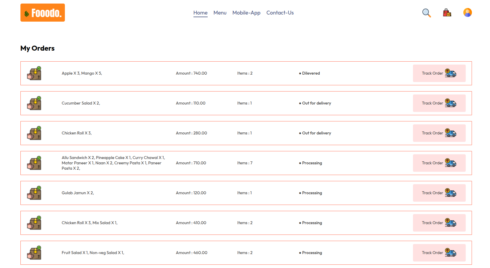
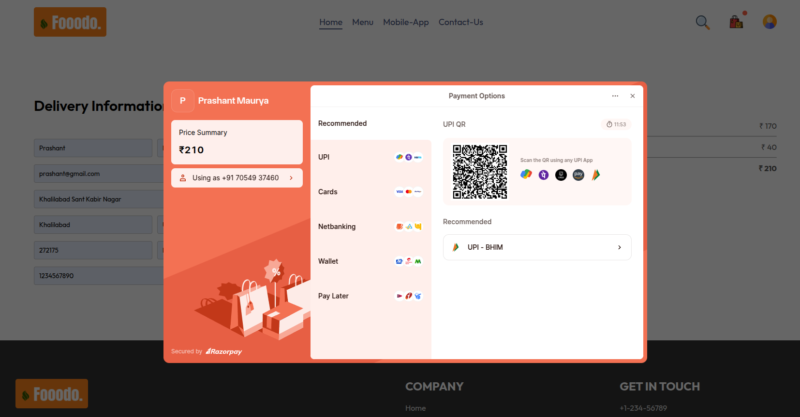

# Fooodo 🍲

**Fooodo** is a user-friendly platform that simplifies online food ordering. With seamless navigation and a variety of features, users can:

- **Sign Up / Log In:** Create an account or log in to manage orders and preferences.
- **Browse Menu:** Explore a diverse selection of dishes with detailed descriptions and prices.
- **Track Orders:** Monitor order status in real-time, from preparation to delivery.
- **Secure Online Payments:** Utilize Razorpay for safe and convenient transactions.

---

## 🚀 Features

### 🔒 Home Page
  
Landing page with secure sign-up and log-in processes to personalize user experiences.

### 📜 Menu Exploration
  
Browse through various cuisines and dishes with ease.

### 🚚 Order Tracking
  
Stay updated on your order's journey from the kitchen to your doorstep.

### 💳 Online Payment via Razorpay
  
Enjoy secure and swift payments through Razorpay integration.

---

## 🛠️ Tech Stack

- **Frontend:** React.js, CSS
- **Payment Gateway:** Razorpay
- **Hosting:** Netlify

---

## 🌐 Deployment

Fooodo is live and accessible at: [https://fooodofoods.netlify.app/](https://fooodofoods.netlify.app/)

---

## 💡 Contributing

We welcome contributions! Feel free to fork the repository and submit pull requests.

---

## 📬 Contact

For questions or feedback, reach out via:

- **Email:** [mauryaprashant1510@gmail.com](mailto:mauryaprashant1510@gmail.com)
- **LinkedIn:** [Prashant Maurya](https://www.linkedin.com/in/prashant-maurya-017776246/)

---

